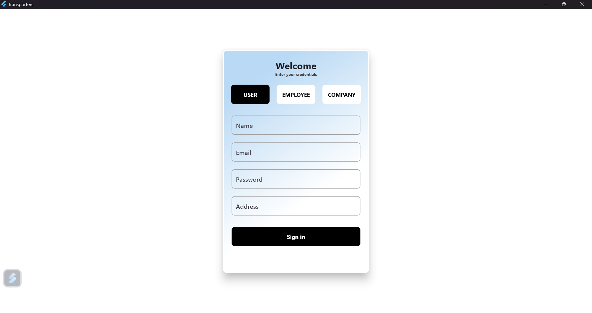
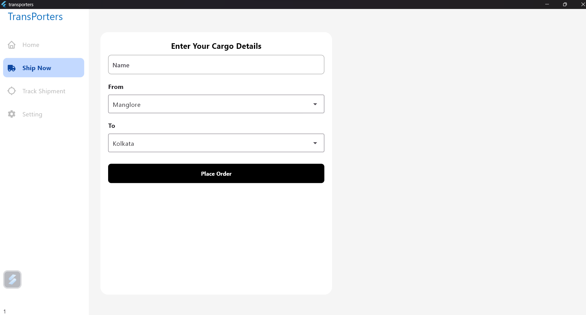

# **Flutter** & **Go** Logistics App

A logistics app for both users and companies to track, manage, and coordinate deliveries.

---

### 🚀 Features

#### 👤 Users Can:
- Order shipping services
- Track their orders

#### 🏢 Companies Can:
- Manage employees
- Manage orders
- Manage ships & ports

---

### 📸 Demo

#### 🔐 Authentication



#### 🏠 Home Page


#### 📦 Order Page



## 🏁 Getting Started (For Developers)


1.  **Ensure you have the Flutter SDK installed.** You can find instructions on the [official Flutter website](https://flutter.dev/docs/get-started/install).
2.  **Clone the repository:**
   
    git clone [`https://github.com/Sunil-Andrade/logistics-app.git`](https://github.com/Sunil-Andrade/logistics-app.git)
   
3.  **Navigate to the project directory:**
    ```bash
    cd transporters
    ```
4.  **Get the dependencies:**
    ```bash
    flutter pub get
    ```
5.  **Run the application:**
    ```bash
    flutter run
    ```
    
6. **Ensure you have Go installed.** You can find instructions on the [official Go website](https://go.dev/doc/install).

7. **Navigate to the project directory:**

   ```bash
   cd LogisticServer
   ```
8. **Get the dependencies:**
    ```bash
    go mod tidy
    ```
9. **Run the application:**

    ```bash
    go run main.go
    ```

---


**Thank you for your interest in Logistics-app**

